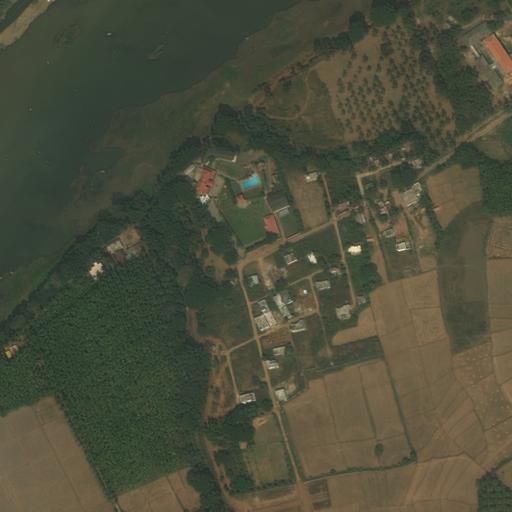
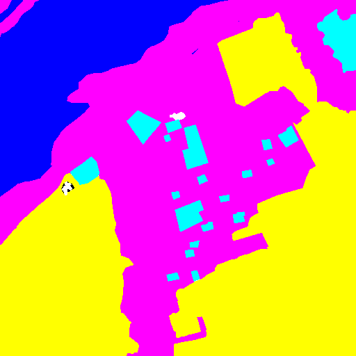
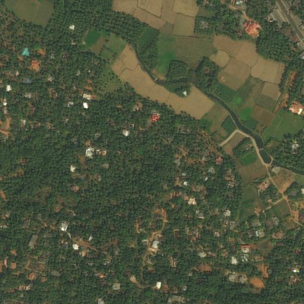
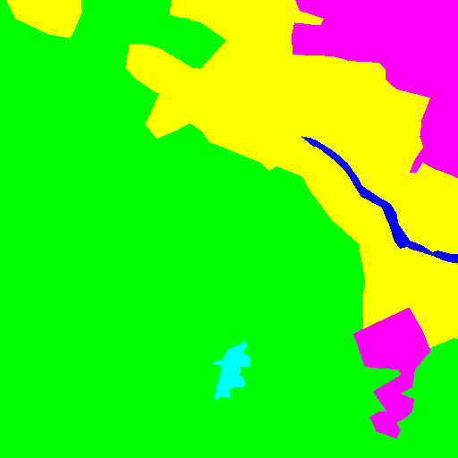

# Semantic-Segmentation

## Introduction
  This repo is a implementation of deep-learning methods of **semantic segmention**. FCN (Fully Convolutional Netowrks) is implemented and experimented. For more detatail information, please read the [original paper](https://people.eecs.berkeley.edu/~jonlong/long_shelhamer_fcn.pdf)

## Dataset
  In this repo, the dataset is from DLCV2018 class in NTUEE, which contains landscape images taken from the artificial satilite, and its corresponding semantic segmentation mask.
  the example is as follow:

  images from artificial satelite | corresponding mask 
  ------------------------------- | ------------------
    | 
    | 

  colors are different for each label as follow:
  * Cyan   - Urban land
  * Yellow - Agriculture land
  * Purple - Rangeland
  * Green  - Forest land
  * Blue   - Water
  * White  - Barren land
  * Black  - Unknown
